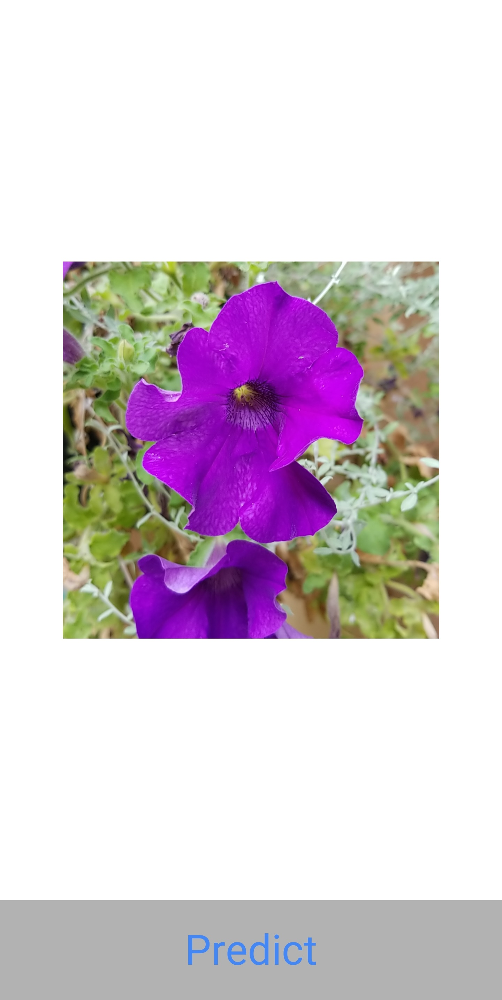
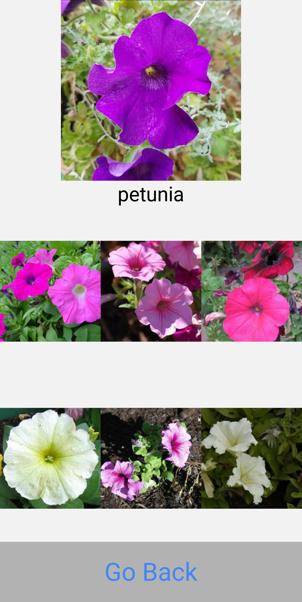

# Flower Identification Mobile App for Android

A mobile app for Android that uses the phone camera to identify 102 species of flowers trained on the Oxford 102 Category Flower Dataset. The model uses MobileNet as a feature extractor and is deployed on Heroku via TensorFlow Serving.

    
    

